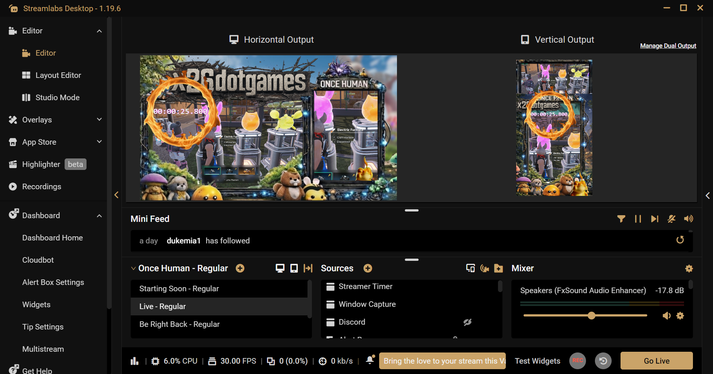
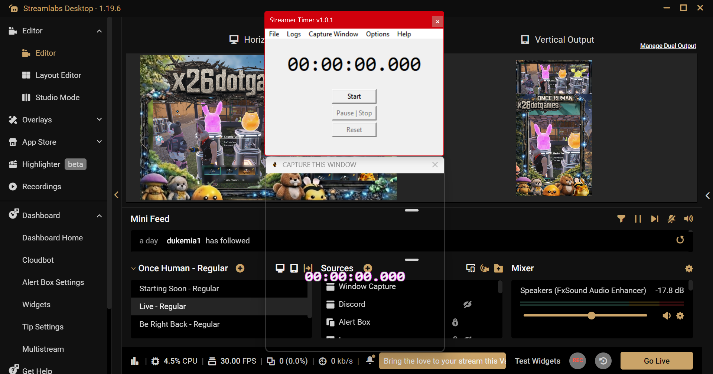

# Streamer Timer Desktop App

> Custom streamer tools available on request.

A lightweight desktop timer tool built for streamers who want real control over their overlays — not just static video files or browser-based widgets.

---

## 🚀 Features

- ⏱ Start / Pause / Reset controls  
- 🖥 Transparent overlay window (OBS-ready)  
- ⚡ Lightweight and fast  
- 🎯 Designed for real streaming workflows  
- 🔧 No browser source required  

---

## 🧠 Why this exists

Most “stream timers” online are:
- pre-rendered video files (.mp4)  
- static overlays with no control  
- limited customization  

This project provides a **real software-based solution** with full control and flexibility.

---

## 📥 Download

Go to the **Releases** section and download the latest version:

👉 [Download Latest Release](../../releases)

---

## 🛠 Built With

- Python  
- Tkinter  
- Desktop-based architecture  

---

## 💡 Use Cases

- OBS stream timer overlay  
- Twitch / Kick / YouTube streams  
- Speedrun timing  
- Stream countdowns  

---

## ❤️ Support

This project is donation-supported.

If you want:
- custom features  
- automation tools  
- streamer utilities  

For custom builds or feature requests, feel free to reach out.

---

## ⚠️ Notes

- Designed for Windows  
- May require OBS window capture depending on setup  
